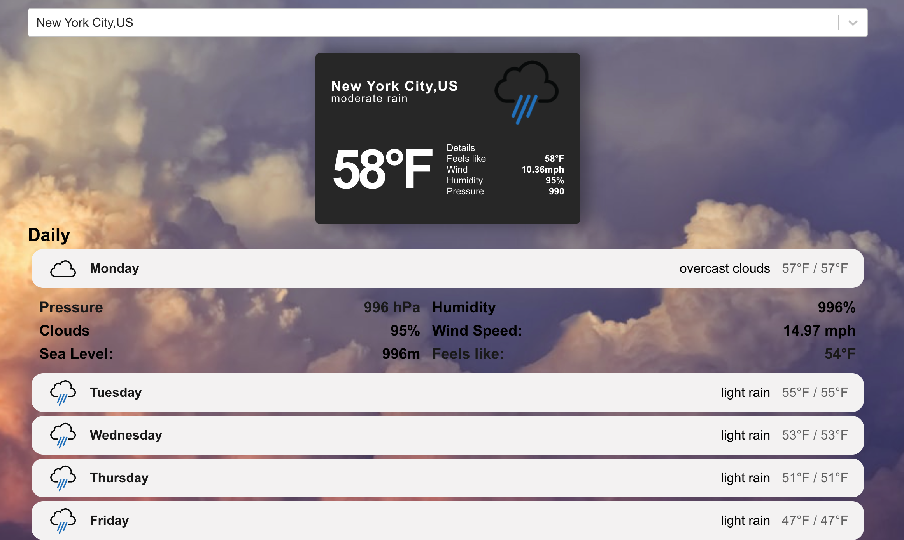

## Made a weather app.  Learned how to connect to an existing Api and interact with it by grabbing data.  The api was giving me the temperature in kelvin and metrics unit and had to figure out how to convert it to Fahrenheit and to use the imperial system.

